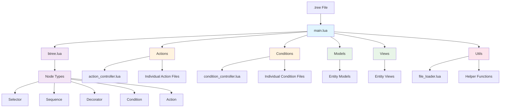

# Behavior Tree Architecture Diagram

This diagram shows the relationships between components in the Behavior Tree architecture. The main.lua file serves as the entry point and orchestrates all other components. The btree.lua implements the core behavior tree logic, while models, views, actions, conditions, and utilities provide specialized functionality.