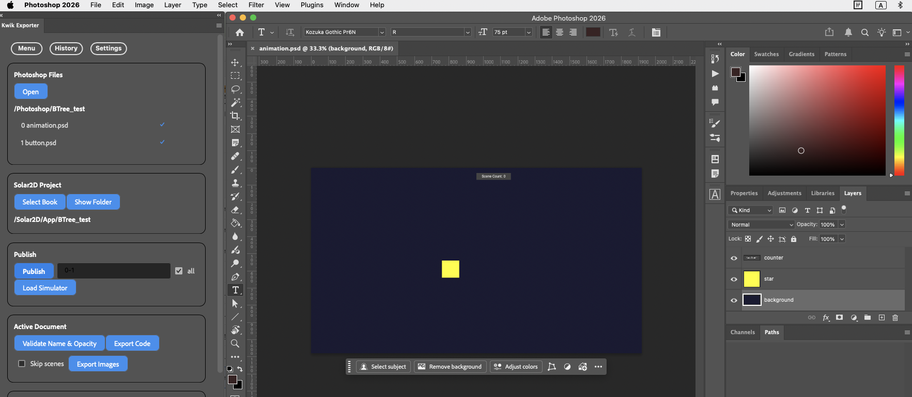

1. create a Book & Page

  - [ ] symblic link for Scrits folder

     ```
     ln -s ../kwik5-project-template/Scripts Scripts
     Scripts/create_book.command Solar2D BTree_test "animation button"
     ```

  - [ ] run create_book script with book name with pages

     ```
     bash Scripts/create_book.command Solar2D BTree_test "animation button"
     ```

2. create yamls for images

   - [ ] ask AI to create yaml files for images out of behaviorTree/views

     your task is described here, create yaml files in Solar2D/App/BTree_test/spec folder

      **Instructions:**

      Generate a YAML file (`${scene}_layers.yaml`) by finding image assets(objects) in Solar2D/App/BTree_test/behaivorTree/views folders.

      **IMPORTANT: All properties listed below MUST be included for each layer. Do not omit any properties.**

      ```yaml
      - name: <asset_name>
        type: <background|character|prop>
        x: <x_position>
        y: <y_position>
        width: <width_in_pixels>
        height: <height_in_pixels>
        z_index: <layer_order>
        color: <hex_color_for_layer_fill>  # Fill color for the layer shape/rectangle
        text: <optional_text_label_or_empty_string>
        font_size: <font_size_or_default_16>
        text_color: <hex_color_for_text>  # MUST be different from 'color' property
        visible: <true|false>
        opacity: <0-100>
      ```

      **Property Requirements:**

      - **color**: The fill color for the layer/shape (e.g., "#FF5733", "#3498DB"). This represents the background color of the layer rectangle. Should be distinct and appropriate for the asset type.
      - **text_color**: The color for any text labels (e.g., "#FFFFFF", "#000000"). MUST be different from the `color` property to ensure text visibility.
      - **text**: If no text is needed, use an empty string `""` - do not omit this property.
      - **font_size**: If no text, still provide a default value (e.g., 16).
      - **All numeric properties** (x, y, width, height, z_index, font_size, opacity) must have actual values, not placeholders.
      - **visible**: Typically `true` unless the layer should start hidden.

      **Example:**

      ```yaml
      - name: background_forest
        type: background
        x: 0
        y: 0
        width: 1920
        height: 1080
        z_index: 0
        color: "#2C5F2D"
        text: ""
        font_size: 16
        text_color: "#FFFFFF"
        visible: true
        opacity: 100
      - name: character_hero
        type: character
        x: 960
        y: 540
        width: 400
        height: 600
        z_index: 10
        color: "#8B4513"
        text: "Hero"
        font_size: 24
        text_color: "#FFD700"
        visible: true
        opacity: 100
      ```

3. create the psd

   - [ ] review and rename names of layers in the yamls

      ex. the final animation.yaml

      ```yaml
        - name: background
         type: background
         x: 0
         y: 0
         width: 1920
         height: 1080
         z_index: 0
         color: "#1A1A33"
         text: ""
         font_size: 16
         text_color: "#FFFFFF"
         visible: true
         opacity: 100

       - name: star
         type: character
         x: 760
         y: 540
         width: 100
         height: 100
         z_index: 10
         color: "#FFFF00"
         text: ""
         font_size: 16
         text_color: "#000000"
         visible: true
         opacity: 100

       - name: counter
         type: prop
         x: 960
         y: 30
         width: 200
         height: 40
         z_index: 20
         color: "#444444"
         text: "Scene Count: 0"
         font_size: 20
         text_color: "#FFFFFF"
         visible: true
         opacity: 100
     ```

  - [ ] run the script to create .psd files

     ```sh
     #!/bin/bash

     book="BTree_test"
     pages=("animation" "button")  # Add your page names here

     for page in "${pages[@]}"; do
         echo "Processing page: $page"

         python ./Scripts/create_layered_psd.py \
             "Solar2D/App/${book}/spec/${page}_scene_layers.yaml" \
             "./Photoshop/${book}/${page}.psd"

         # Optional: Check if the YAML file exists before processing
         if [ ! -f "Solar2D/App/${book}/spec/${page}_scene_layers.yaml" ]; then
             echo "Warning: YAML file for page '$page' not found. Skipping..."
             continue
         fi
     done
     ```

4. Photoshop - Kwik Exporter

     

    - [ ] publish them

5. Solar2D Simulator - Kwik Editor

    -  [ ] ediit main.lua to change the default book & page

     ```lua
     env.book = "BTree_test"
     env.goPage = "animation"
     ```

6. linking the obj in UI.sceneGroup with the obj reference in behaviorTree

    -  [ ] App/uiHandler.lua to set the book path

      TODO change it to BTree_test

      ```lua
      local resourcePath = system.pathForFile("", system.ResourceDirectory)
      local appPath = "/App/TheLastSpark/behaviorTree"
      package.path = resourcePath .. appPath.."/?.lua;" .. resourcePath .. appPath.."/?/?.lua;"..package.path
      ...
      ...
      function M:create(UI)
        -- print(UI.props.appName, UI.props.gotoPage)
        -- UI.mycode:createDica(UI)
        if UI.behaviorTree then
          UI.behaviorTree:create()
        end
      end

      function M:willShow(UI)
        if UI.behaviorTree then
          UI.behaviorTree:show({phase = "will"})
        end
      end
      ...
      ...
      ```

    - behaivorTree/utils/common_helpers.lua

      looking up object name from UI.sceneGroup

      ```lua
      function M.createCharacter(objectName, model, layout, parentGroup, overrides)
          local template = (model.objects or {})[objectName] or {}
          local layoutData = (layout.objects or {})[objectName] or {}
          local modelData = M.buildDisplayModel(template, layoutData, overrides or { visible = false })
          --
          if M._env.UI then
            local lookupName = objectName.."_"..modelData.currentState
            local obj = M._env.UI.sceneGroup[lookupName]
            -- If not found with state suffix, try without it (for Kwik components without state)
            if not obj then
              obj = M._env.UI.sceneGroup[objectName]
            end

            if obj then
              -- Remove from current parent and add to the behavior tree's parentGroup
              if parentGroup and obj.parent ~= parentGroup then
                parentGroup:insert(obj)
              else
                print("DEBUG createCharacter: No reparenting needed (already in correct parent or no parentGroup)")
              end
              obj.isVisible = modelData.visible
              -- Store reference to model data
              obj.modelData = modelData
            else
              local DisplayBase = require("views.display_base")
              obj = DisplayBase:create(parentGroup, modelData)
            end
            return obj
          else
            print("DEBUG createCharacter: Using pure BehaviorTree mode (no UI)")
            local DisplayBase = require("views.display_base")
            local obj =  DisplayBase:create(parentGroup, modelData)
                obj.x = modelData.x + (display.contentWidth - 480)/2
                obj.y = modelData.y + (display.contentHeight - 320)/2
            return obj
          end
      end
      ```

7. create kwik animation in Kwik Editor in Solar2D simulator

     - [ ] disable the animation in BehaviorTree, and use the animtion by kwik

     coworking

     - [ ] play the animation in BehaviorTree with an animation (rotation) in Kwik

      - [ ] receive button clicked event and play a kwik action