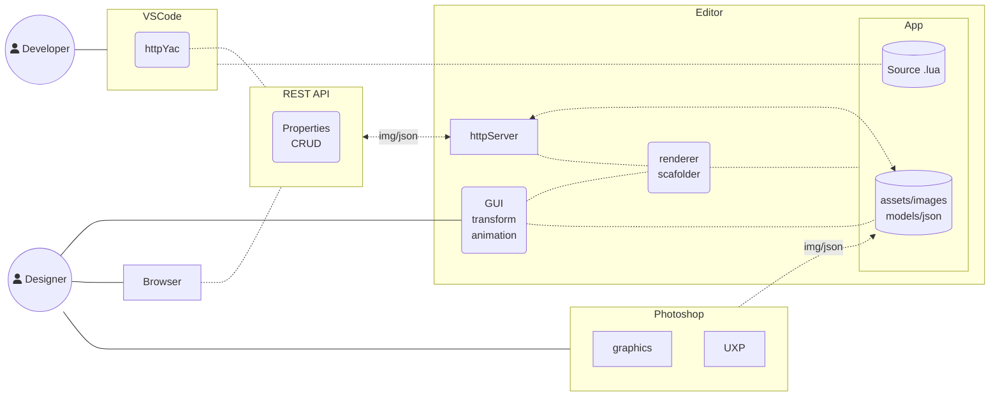
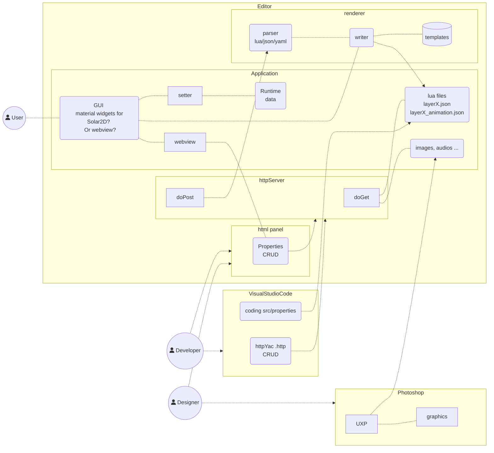

## Architecure

html panel
- browser
- uxp panel
- webview

rest api

> pegasus is runningin Editor

1. run Editor

1. upload an image to pegasus server
	- save it assets/images/book/
    - create display.object
    - .json

uxp

> indirect, async

1. outputs images/json to App

	> offline

1. run Editor

