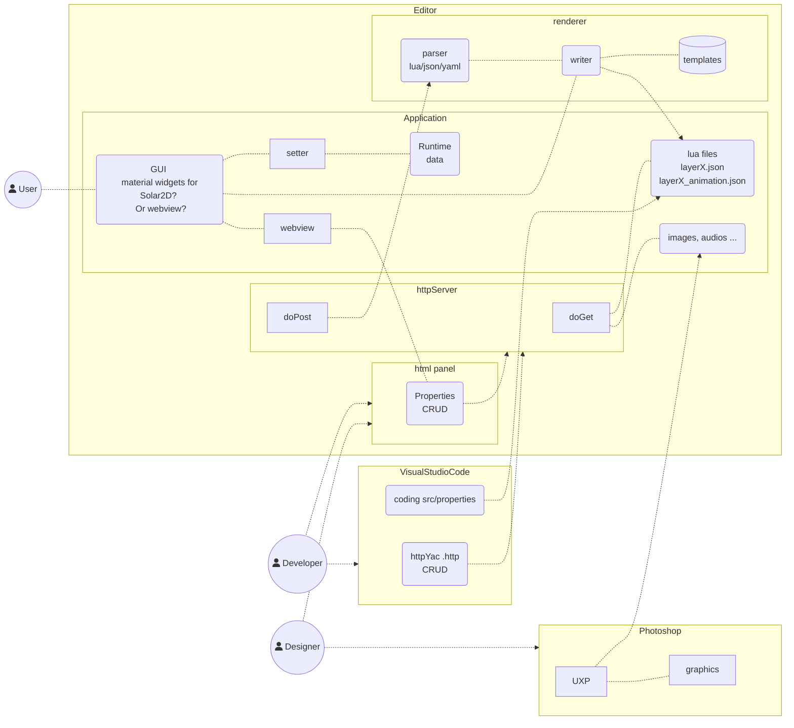

## Architecure

html panel
- browser
- uxp panel
- webview

```mermaid
flowchart LR

Designer((fas:fa-user Designer))
Developer((fas:fa-user Developer))
User((fas:fa-user User))

subgraph Photoshop
	graphics
	UXP
end

subgraph VisualStudioCode
	httpYac(httpYac .http <br> CRUD)
	coding(coding src/properties)
end

subgraph Editor[Editor]
	subgraph App[ Application]
		src(lua files <br>layerX.json<br>layerX_animation.json<br>)
		assets(images, audios ...)
		runtime(Runtime<br> data)
		GUI(GUI <br> material widgets for Solar2D? <br> Or webview?)
		webview
		setter
	end
	subgraph renderer
		parser(parser<br>lua/json/yaml)
		writer(writer)
		templates[(templates)]
	end
	subgraph httpServer
		doGet
		doPost
	end
	subgraph htmlPanel[html panel]
	form(Properties <br> CRUD)
end

end


parser -.- writer
writer -.- templates
setter -.- runtime
GUI    -.- writer
GUI    -.- setter

coding -.-> src


UXP -.- graphics
UXP -.-> assets

doPost -.-> parser
writer -.-> src

form -.-> httpServer
doGet -.- src
doGet -.- assets

httpYac -.-> httpServer

webview -.- form
GUI -.- webview

User -.- GUI
Designer -.-> Photoshop
Designer -.-> htmlPanel

Developer -.-> htmlPanel
Developer -.-> VisualStudioCode


```