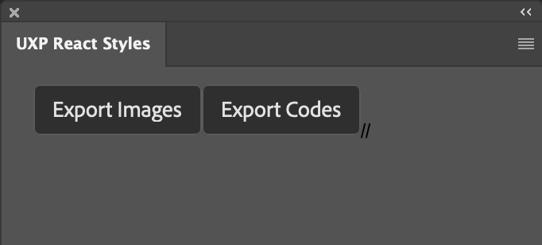
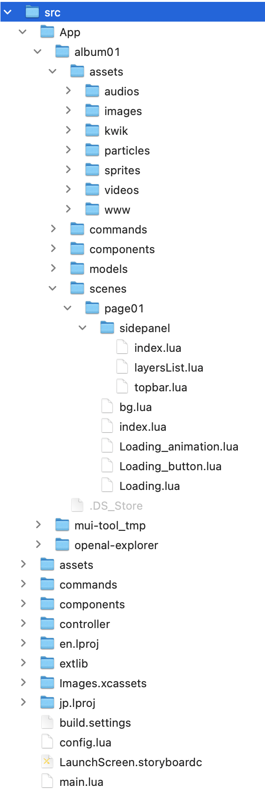
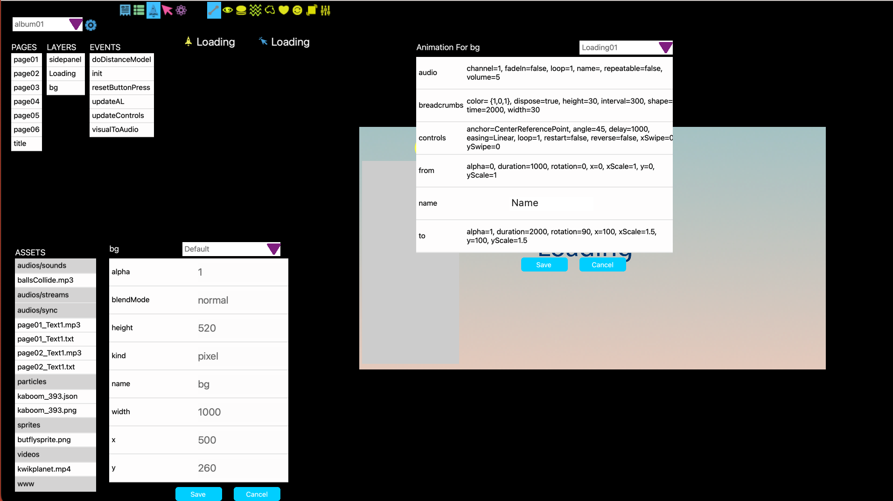
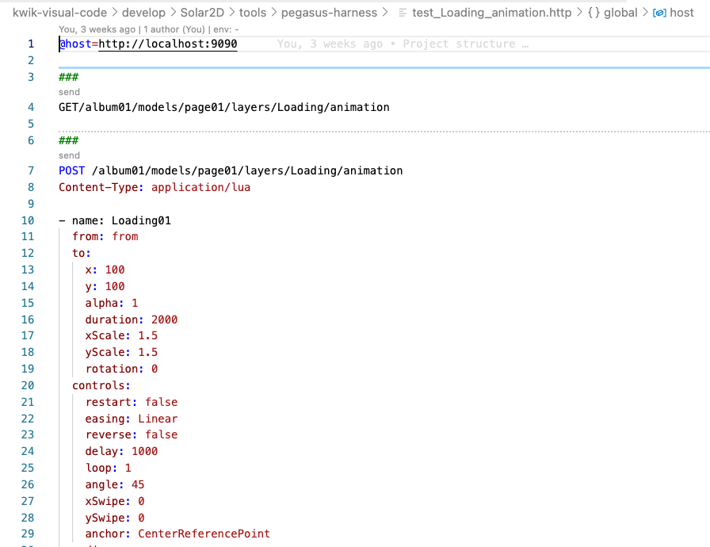
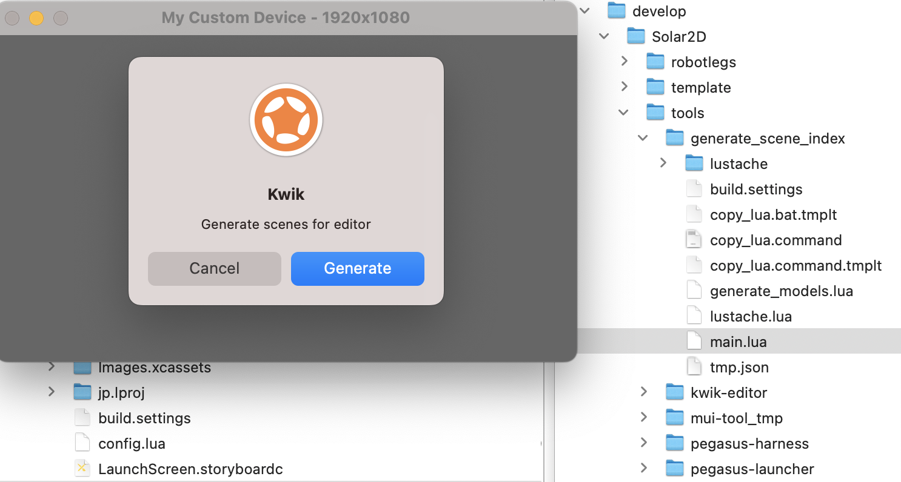

# Design

- project model
  - robotlegs
  - template
    - components
    - commands

- image exporter

  PS/XD UXP

- visual editor

- tools
  - generate_scene_index
  - pegasus-harness
  - pegasus-launcher

- sample projects

---
Image Exporter plugin for Adobe Photoshop

---
Project Model

> /kwik5/sandbox/Ps/react-uxp-styles/Project/Solar2D

---
Visual Editor

---
Tools

> develop/Solar2D/tools/pegasus-harness
> develop/Solar2D/tools/pegasus-launcher

generate_scene_index

