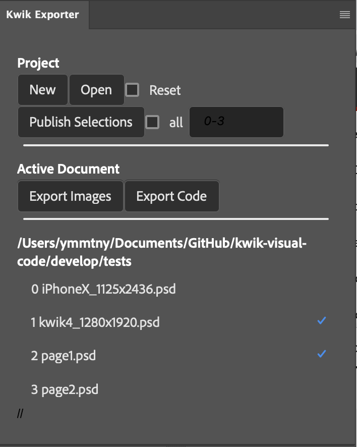
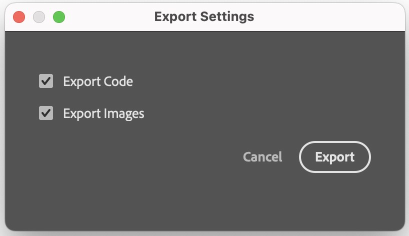

### UXP Plugins

Kwik4 created a project folder where psd files are placed.
Kwik5 you can creat a folder for your psd files on your own. When Kwik Exporter opens, it asks for the folder location.

#### Exporter plugins for PS, XD

- develop/UXP/kwik-exporter
  - New
  - Open psd files from a folder (TODO)

    the folder name/path is saved in a json

  - Publish selected psd files (TODO)

      - Drag & Drop  to change the order of psd files

        one psd file corresponds one **scene** in Solar2D code.

        a psd can be marked for being ignored

  - Export images
  - Export code

  {{}}

  **Publish** all images of selected documents

  1. mark checkboxes of document's names you want to publish

    https://developer.adobe.com/xd/uxp/uxp/reference-spectrum/User%20Interface/

    spectrum tableview is not yet supported in UXP

    https://react-spectrum.adobe.com/react-spectrum/TableView.html

      - Ctl(Win) or Option(Mac) + Space key toggles selection for the focused row

      - toggle all on/off

  1. clcik

      opendFileDialog asks a **book folder** under App folder.

      {{}}

  **Active Document** Export Images for an active document document

  1. open .psd by cliking the psd name in the list

      Kwik4_1280x1920.psd with background image 1440x2776

      > kwik5 does not request the canvas size of .psd as 1280x1920 when publising

      {{}}

  1. clcik Export Images

      openFileDialog asks a **book folder** under App folder.

        {{}}

  **Active Document** Export each image of a layerSet(layer group)  in .psd

  1. create a folder with same name as layerSet in book/assets/images/FILE_NAME_OF_PSD

      for instance, "bg" is a layer group of kwik4_1280x1920.psd

      {{}}

      you can manually create the bg folder under App/book/assets/images/kwik4_1280x1920 so the export images function knows where to put images of sub layers of a group.

      > If such no folder with the same name as a layer group, the one image of a layer group is exported.

      {{}}

      {{}}

    > A concept of Kwik5 is to use App folder as a project base. It is a kind of file based database where .json, .lua and assets files are placed. No more .kwk xml file of Kwik4

    > Direclty Editing  a file under App folder while running Solar2D Simulator means a live editing. No more build4 folder of Kwik4 either

  **TODO** Active Document > Layer Selection Only

----
#### Editor Frontend for PS, XD

> ref Anima plugin for Adobe XD