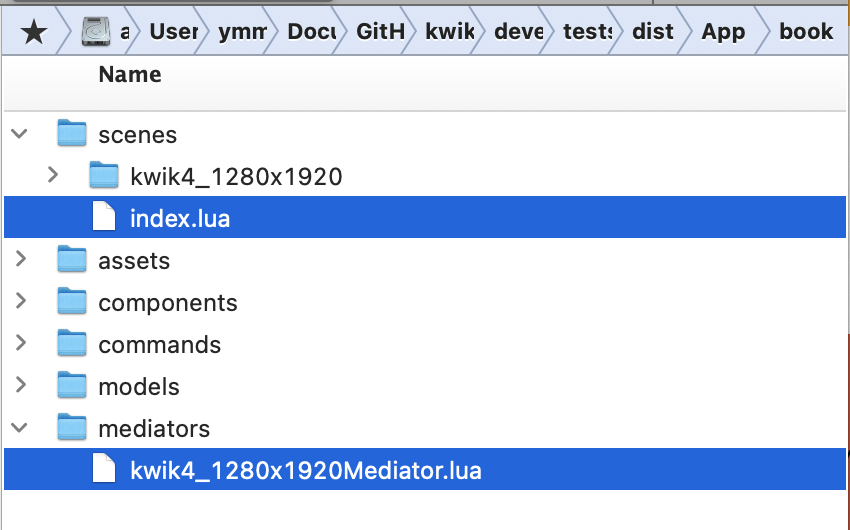
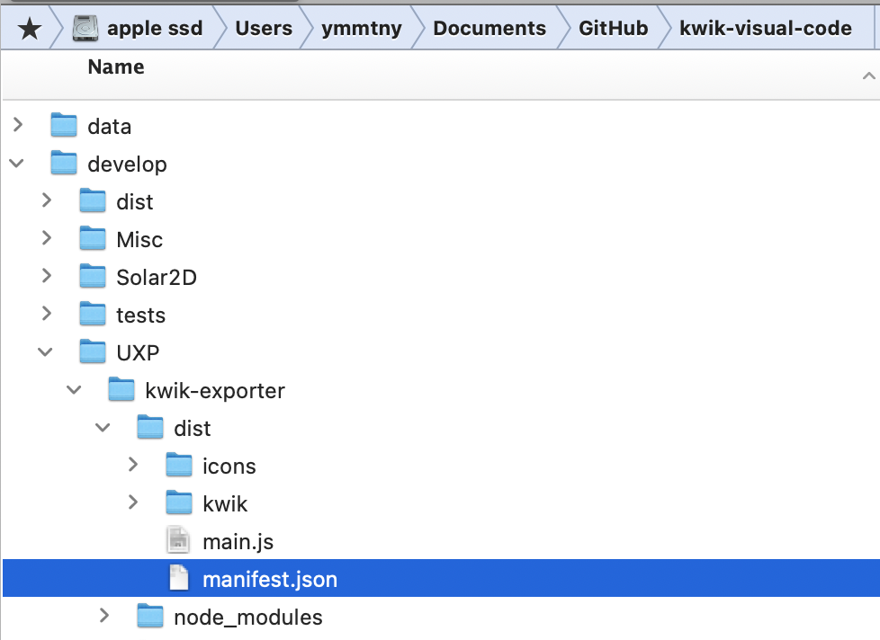
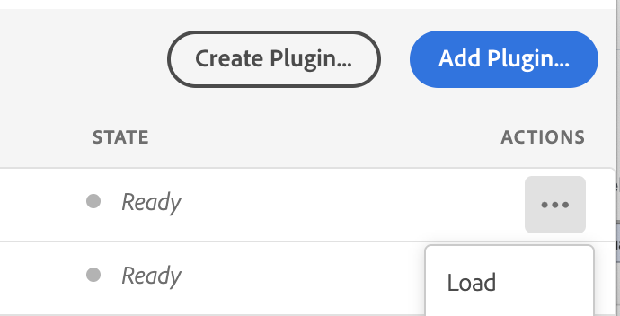
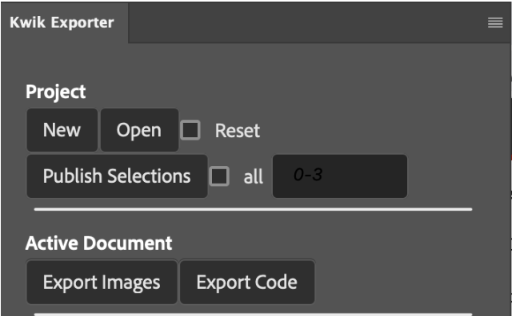
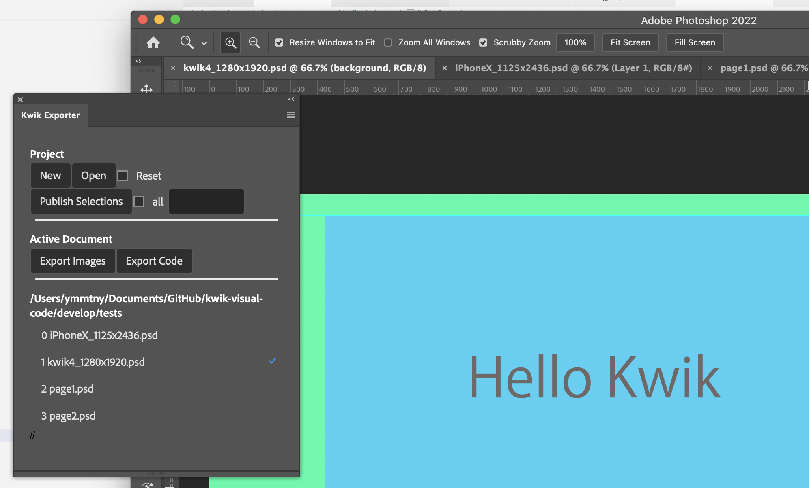
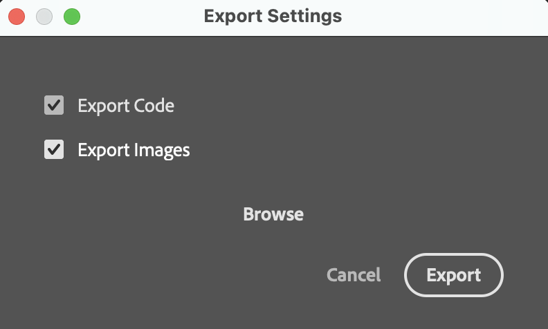
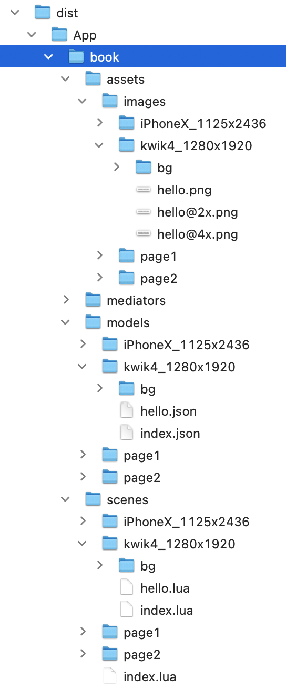
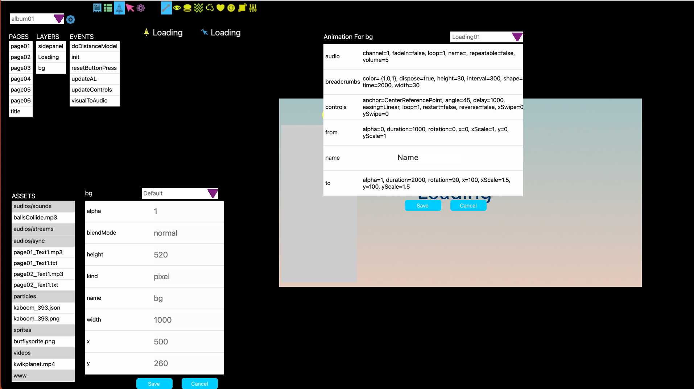

TODO

- WIP call develop/Solar2D/tools/generate_scene_index.lua. Use typescript to lua!? lua to js?　⭐️

 

  - generate scenes/index.lua
  - generate mediators/.lua

  FIX develop/tests/dist/App/book/scenes/kwik4_1280x1920/index.lua, BUG: weight is generated as a layer object

  ```lua
  local scene = require('controller.scene').new(sceneName, {
    name = "kwik4_1280x1920",
    layers = {
          {  weight={
                            } },
          {  bg={
                            } },
          {  weight={
                            } },
  ```

  --

# Get Started

1. Open Adobe UXP Developer Tool

    Add Plugin to select develop/UXP/kwik-exporter/dist

    > TODO alpla release folder structure may be different to the current develop

    

    Load it

    

    

1. Project > Open

    you can select the following folder that comes with demo .psd files and kwikconfig.json

    - sample-projects/SingleBook/book01

      - page1.psd
      - page2.psd
      - kwikconfig.json

      ```json
      {
        "name":"book one",
        "output":"../../Solar2D/src/App/book",
        "pages":[
          {"psd":"page01.psd", "name":"page one"},
          {"psd":"page02.psd", "name":"page two"}
        ]
      }
      ```
    > TODO Project Name Text Box to display a selected folder name as default.

    > TODO User can change it and Kwik uses it for a folder name when publshing

    > TODO kwikconfig.json will be created in the selected folder.

1. Double Click the one of .psd in the list to open for editing.

    


1. Click Publish Selections button

    - [x] all

      it will select all the psd files in the list

      Export Settings Dialog appears, click Export

      > TODO show the project name with the default output folder

      

    - Browse button

       Select the folder for output if you change the destination. The default is defined in kwikconfig.json as **"../../Solar2D/src/App/book"**


    - Kwik will publish images/source code. You can find them in

      > TODO change dist to src with SimpleBook sample

      

1. Open main.lua in Solar2D/src with Solar2D Simulator

    TODO UXP::Publish to include swipe page or A/D keys for navigation ⭐️

    kwiconfig.lua
    ```
    debug = {enable = true, navigation= "swipe/keys"}
    ```


----
**Create a new project**

1. Project > New button

    TODO dialog for choice
      -  create a pair of Photoshop & Solar2D project folder

        it will scafold a Solar2D folder of a template to a folder you choose.

        NG Current implementation copies Solar2D folder w/o App

        TODO it would be better to scafold the entire structure of SingleBook sample

      -  create a book folder into Photoshop folder

      select a distination folder

    TODO select portrait or landscape


 ```
  ├── Photoshop
  │   └── book01
  │       ├── kwikconfig.json
  │       └── page01.psd
  └── Solar2D
      ├── rel
      ├── src
      │   ├── App
      │   │   └── book01
      │   ├── Images.xcassets
      │   ├── LaunchScreen.storyboardc
      │   ├── assets
      │   ├── build.settings
      │   ├── commands
      │   ├── components
      │   ├── config.lua
      │   ├── controller
      │   ├── en.lproj
      │   ├── extlib
      │   ├── jp.lproj
      │   ├── main.lua
      │   └── mySplashScreen.png
      ├── templates
      └── tools
```

---

## Tools

### Kwik Editor

develop/Solar2D/tools/kwik-editor

This tool visually edits Soar2D/src files of a Kwik project and is harnessed by Pegasus http-server

TODO Port kwik5/sandbox/Solar2D_MENU/KwikLiveEditor to the folder above. Take diff

TODO editPorpsTable.lua
```
	muiButton.listener = function(event)
		print("button listener")
		local map = {}
		local objs = tableHelper:getTextFields()
		for i=1, #objs do
			print(" "..i..":", objs[i].text)
			models[i].value = objs[i].text
			map[models[i].name] = objs[i].text -- TODO tonumber?
		end

		local tmplt = UI.appFolder.."/../../templates/components/layer_props"
		local path = UI.currentPage.path .."/"..UI.currentLayer.name.."_props"
		util.renderer(tmplt, path, map)
```



↑
Select a layer or an event to review. You can edit values of properties

TODO each kwik component with default values

TODO   ui components like checkbox/selectors ... for each component ⭐️

  > react compnents on webview -- can be shared with UXP panel which may send params via http to pegasus in kwik editor

  > current editPorpsTable.lua servers as plain table viewer & editor

TODO save/copy params to .http (YAML) for httpYac

  TODO how to send text to clipboard from Solar2D　⭐️


---
### Harness

develop/Solar2D/tools/pegasus-harness

- test_character_transitions.http
- test_Loading_animation.http

You can post params with httpYac in VS Code to a Solar2D project

TODO  set Layer varaible with samples

TODO  create models: animation, transition2, button ..., and pegasus-receiver in kwik-editor ⭐️

- Animation_bounce.http

  ```yaml
  POST /layers/logo
  Content-Type: application/yaml

  - transition: bounce
  - params:
      height: 400
      width: 200
      time: 1000
      iterations: 0
  ```


---
### Launcher

develop/Solar2D/tools/pegasus-launcher

- test-Solar2D-SampleCode.http

You can open a solar2D project from VS Code with httpYac

---
## Coding manually in VS Code

1. create .lua for commands or components
1. run the follwoing tool to update scenes/pageX/index.lua to append the new .lua to the index.

    **/develop/Solar2D/tools/generate_scene_index** is a Solar2D application. You can open the main.lua in Solar2D simulator.

    the table in the index.lua is updated by iterating files in App/bookX/components and bookX/commands
