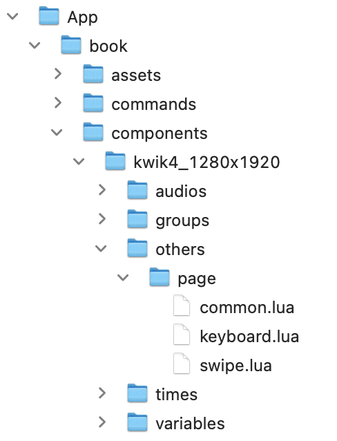

# Components

For instance others/page/swip.lua enables a page transition, and audios can have multiple audio objects.

```lua
local sceneName = ...
--
local scene = require('controller.scene').new(sceneName, {
    name = "kwik4_1280x1920",
    layers = {
          {  bg={
                            } },

    },
    components = {
      audios = { audioOne = {}, audioTwo = {}  },
      groups = {  },
      timers = {  },
      variables = {  },
      others = { "page.swipe", "page.keyboard" }
     },
    events = { myAction,myEvents.testHandler },
    onInit = function(scene) print("onInit") end
})
--
return scene

```

{{}}

## page

- swipe
- keyboard
- common

## audio