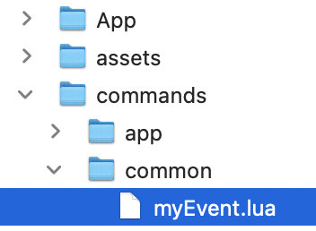

# Events & Commands

## For an event for a page in a book

there are two types

- layer events
- general events

For example in scenes/pageX/index.lua, buttonOne layer has two events, tap and drag, and for general events (kwik calls it Action) are defined as "myAction", "myEvents.testHandler"

```lua
{
    name = "kwik4_1280x1920",
    layers = {
          {  bg={} },
          {  buttonOne={ events = {tap, drag}} },

    },
    components = {
      audios = { },
      groups = {  },
      timers = {  },
      variables = {  },
      others = { }
     },
    events = { "myAction", "myEvents.testHandler" },
    onInit = function(scene) print("onInit") end
}
```

The assicated lua files are these in commands folder

- App/bookX/pageX/commands
  - buttonOne
    - tap.lua
    - drag.lua
  - myAction.lua
  - myEvents/testHandler.lua

---

## For a common event for a book

create a command lua in commands/common directory, for example

- commands/common/myEvent.lua


  ```lua
  local instance = require("commands.kwik.baseCommand").new(
    function (params)
      local e     = params.event
      local UI    = e.UI
      print("commands.myCommonEvent")
    end)
  return instance
  ```

  {{}}

And let it pass in arguments of bootstrap function in main.lua

```lua
local common = {events = {"myEvent"}, components = {myComponent={}}}

require("controller.index").bootstrap({
  name="book", sceneIndex = 1, position = {x=0, y=0},
  common =common
})

```

context:init function of controller/ApplicationContext.lua automtaically adds it

this context init is called everytime when a scene is loaded. You can dispatch an event to executre myEvent.lua like this

  ```lua
  UI.scene:dispatchEvent({
    name = "common.myEvent",
    UI = UI
  })
  ```
