TODO
- [ ] swipe page or A/D keys for navigation
  - [ ] main.lua

    - rendered with Solar2D Project > Select Book, bookFolder

      ```lua
      require("controller.index").bootstrap({name="book", sceneIndex = 1, position = {x=0, y=0}}) -- scenes.index
      ```

  - [ ] scenes/index.lua

    - Active Document index should be set to main.lua's sceneIndex

      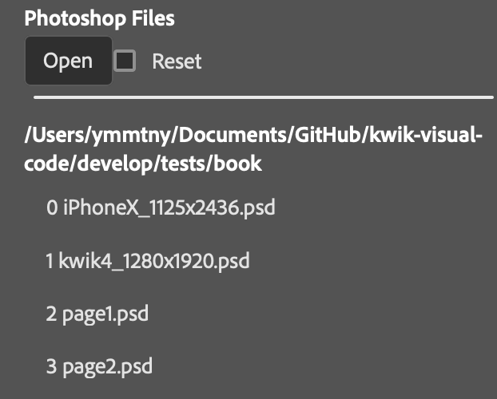

  - [ ] mediators/pageXMediator.lua

    - when publishing, create the file.

- [x] test layer groups and add how to work with a layer group in get started


- [ ] clean image template lua
- [ ] add animation and button
- [ ] add audio & video

# Get Started

{{ %toc% }}

1. Open Adobe UXP Developer Tool

    Add Plugin to select develop/UXP/kwik-exporter/dist

    > TODO alpla release folder structure may be different to the current develop

    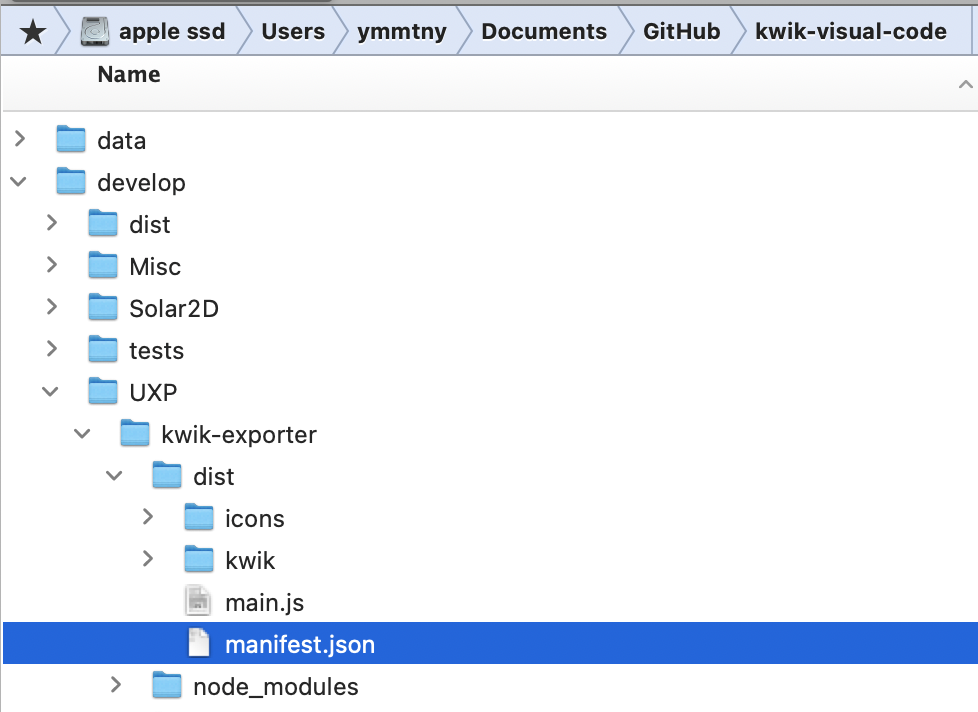

    Load it

    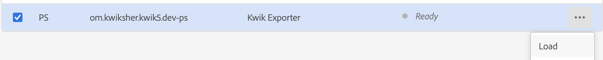

    Kwik Exporter Panel apppears

    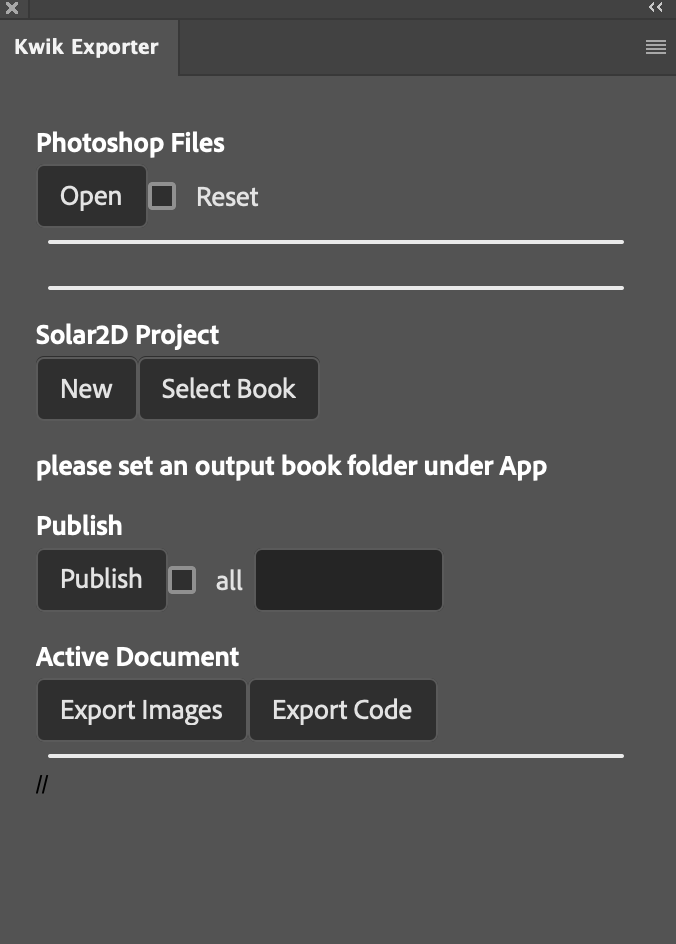

1. Photoshop Files > Open

    you can select the following folder that comes with demo .psd files and kwikconfig.json. You may open a folder of yours which contains psd files.

    - sample-projects/SingleBook/book01

      - page1.psd
      - page2.psd
      - kwikconfig.json

      ```json
      {
        "name":"book one",
        "output":"../../Solar2D/src/App/book",
        "pages":[
          {"psd":"page01.psd", "name":"page one"},
          {"psd":"page02.psd", "name":"page two"}
        ]
      }
      ```
    > TODO Project Name Text Box to display a selected folder name as default.

    > TODO User can change it and Kwik uses it for a folder name when publshing

    > TODO kwikconfig.json will be created in the selected folder.

1. Double Click the one of .psd in the list to open for editing.

    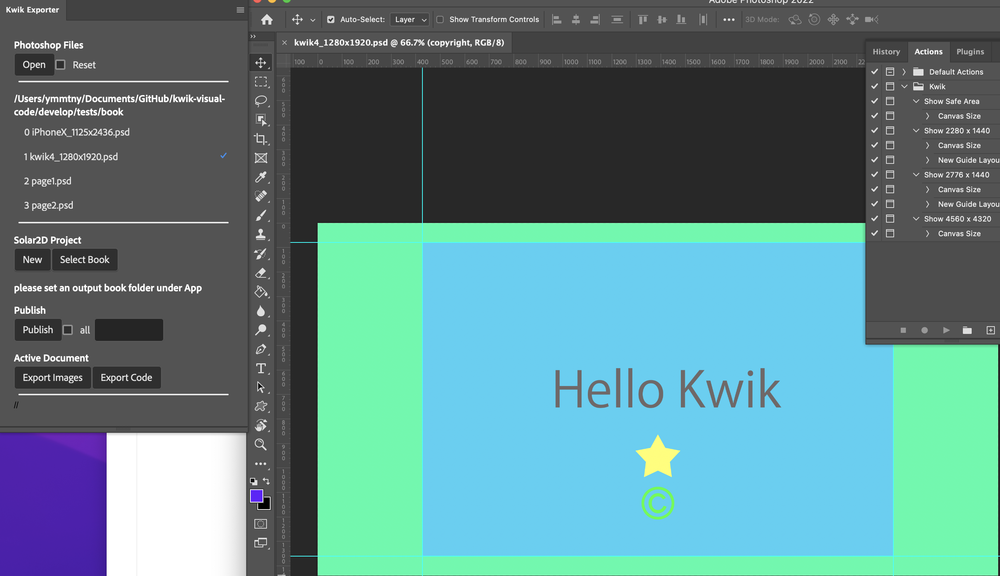

1. Solar2D Project > Select Book

  - New button, a set of Solar2D project will be generated to a selected folder.
  - Select Book

    please select an output folder where each psf files are published. It must be under App folder.

    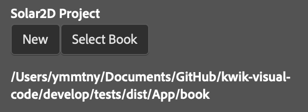

    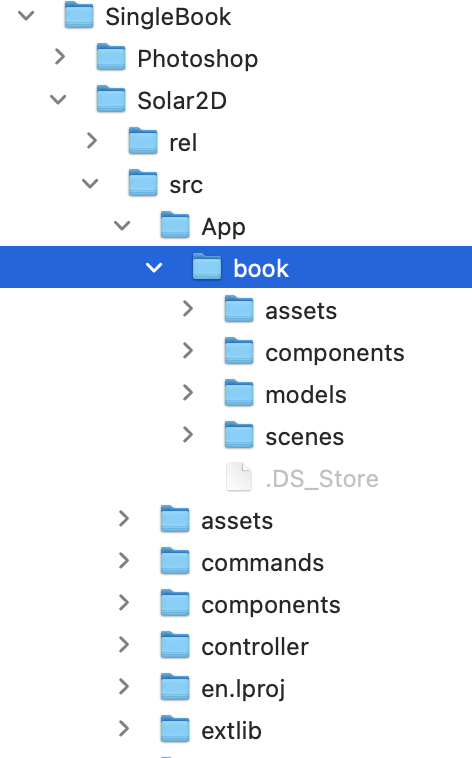

1. Publish

    selected psd files are publihsed to App/book folder

    

    - checkbox all

      it will select all the psd files in the list

    - Input text box

      you can input the index number of psd files to be published for example,

      0, 2-3

    - Publish button

      Export Settings Dialog appears, click Export

      > TODO show the project name with the default output folder

      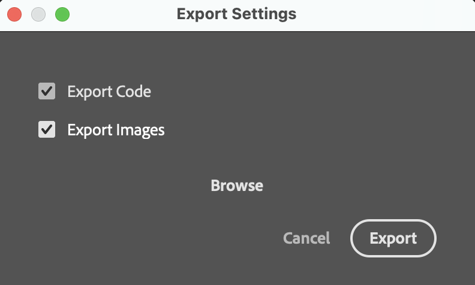

      - Browse button

        Select the folder for output if you like to change the destination. The default is defined in kwikconfig.json as **"../../Solar2D/src/App/book"**


    - Kwik will publish images/source code. You can find them in

      > TODO change dist to src with SimpleBook sample

      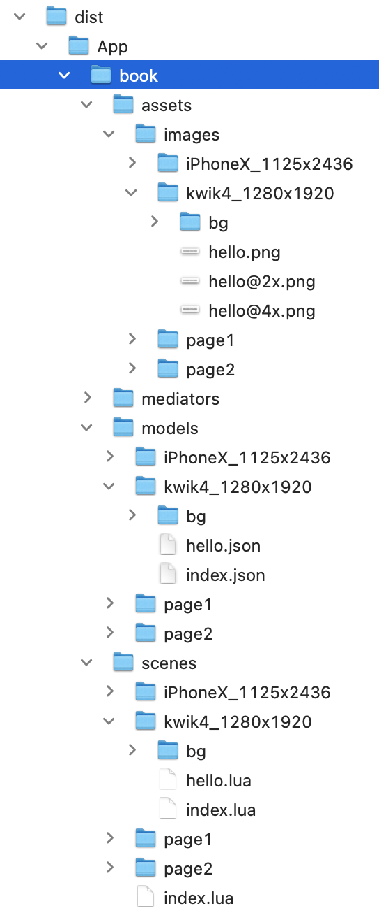

1. Active Document
  - Export Images
  - Export Code

    

## Solar2D Simulator

1. Open main.lua in Solar2D/src with Solar2D Simulator

    TODO UXP::Publish to include swipe page or A/D keys for navigation ⭐️

    kwiconfig.lua
    ```
    debug = {enable = true, navigation= "swipe/keys"}
    ```

### Custom Code

  you can put your own code into commands and scenes folder. Kwik Exporter traverses folders of Solar2D project to integrate your additional files.

  - commands/*.lua
  - scenes/*.lua

  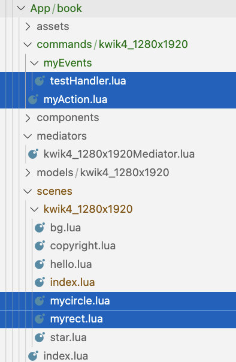

for instance, myrect.lua calls myEvents.testHandler when user taps the rect.

The $weight is a meta variable. A scene componet(layer or your custom code)with lower value will be placed top. The top layer from Photoshop is zero. Then values are increases to until the background layer. For your custom code , you can use minus or positive with decimal. For example, myrect is -2, mycircle is -1. If you change weight values of custom code files, don't forget to publish code again.

  ```lua
  -- $weight=-2
  --
  local _M = {}
  --
  function _M:init(UI)
  end
  --
  function _M:create(UI)
    local sceneGroup = UI.scene.view
    local obj = display.newRect( sceneGroup, display.contentCenterX, display.contentCenterY-100, 100, 100 )
    obj:setFillColor(0.2,0.2,0.2);

    obj:addEventListener("tap", function()
      UI.scene:dispatchEvent({
        name = "myEvents.testHandler",
        UI = UI
      })
    end)
  end
  --
  function _M:didShow(UI)
  end
  --
  function _M:didHide(UI)
  end
  --
  function  _M:destory()
  end
  --
  return _M
  ```

myEvents.testHandker.lua

  ```lua
  local instance = require("commands.kwik.baseCommand").new(
    function (params)
      local e     = params.event
      local UI    = e.UI

      print("commands.myEvents.testhander")

      UI.scene:dispatchEvent({
        name = "myAction",
        UI = UI
      })

    end
  )
  --
  return instance
  ```

You can find your custom code are inserted in scenes/{PSD FILENAME}/index.lua. The layers are sorted internally by values of meta weight variables.

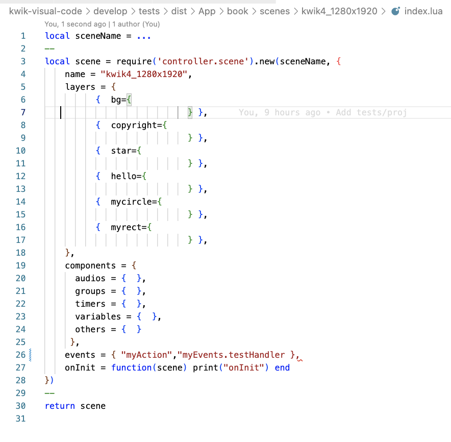

----
## Layer Groups

You can export images of a layer group individually.

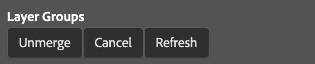

Select layer groups and then click Unmerge button.

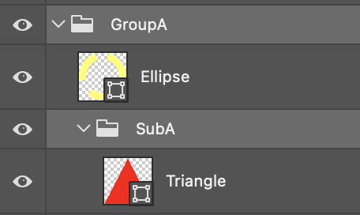

If you want to cancel a layer group to be unmerged, Check it and click Cancel button. It will disppaer from the list.

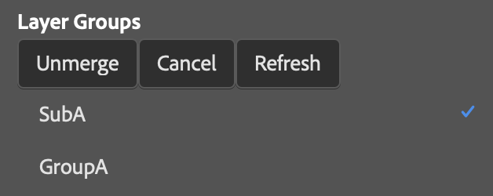

The source files and the images are exported when you publish.

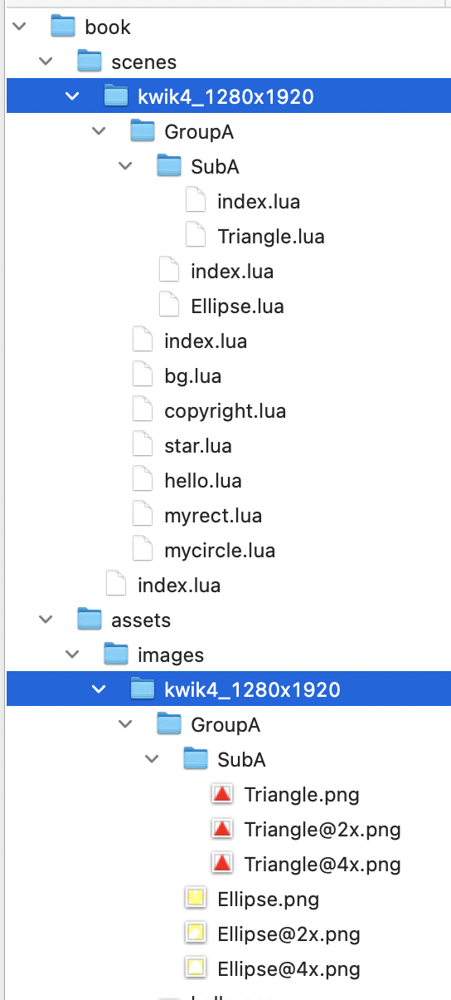

> TODO fix the bug that unmerged group is not indexed at the right position in index.lua

  ```lua
  local scene = require('controller.scene').new(sceneName, {
      name = "kwik4_1280x1920",
      layers = {
            {  bg={
                              } },
            {  copyright={
                              } },
            {  star={
                              } },
            {  hello={
                              } },
            {  mycircle={
                              } },
            {  myrect={
                              } },
            {  GroupA={
                  { SubA = {  } },            } },
      },
  ```


----

## Create a new project

  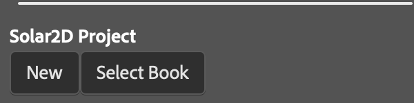

1. Solar2D Project > New button

    TODO dialog for choice
      -  create a pair of Photoshop & Solar2D project folder

        it will scafold a Solar2D folder of a template to a folder you choose.

        NG Current implementation copies Solar2D folder w/o App

        TODO it would be better to scafold the entire structure of SingleBook sample

      -  create a book folder into Photoshop folder

      select a distination folder

    TODO select portrait or landscape


 ```
  ├── Photoshop
  │   └── book01
  │       ├── kwikconfig.json
  │       └── page01.psd
  └── Solar2D
      ├── rel
      ├── src
      │   ├── App
      │   │   └── book01
      │   ├── Images.xcassets
      │   ├── LaunchScreen.storyboardc
      │   ├── assets
      │   ├── build.settings
      │   ├── commands
      │   ├── components
      │   ├── config.lua
      │   ├── controller
      │   ├── en.lproj
      │   ├── extlib
      │   ├── jp.lproj
      │   ├── main.lua
      │   └── mySplashScreen.png
      ├── templates
      └── tools
```

---

## Tools

### Kwik Editor

develop/Solar2D/tools/kwik-editor

This tool visually edits Soar2D/src files of a Kwik project and is harnessed by Pegasus http-server

TODO Port kwik5/sandbox/Solar2D_MENU/KwikLiveEditor to the folder above. Take diff

TODO editPorpsTable.lua
```
	muiButton.listener = function(event)
		print("button listener")
		local map = {}
		local objs = tableHelper:getTextFields()
		for i=1, #objs do
			print(" "..i..":", objs[i].text)
			models[i].value = objs[i].text
			map[models[i].name] = objs[i].text -- TODO tonumber?
		end

		local tmplt = UI.appFolder.."/../../templates/components/layer_props"
		local path = UI.currentPage.path .."/"..UI.currentLayer.name.."_props"
		util.renderer(tmplt, path, map)
```

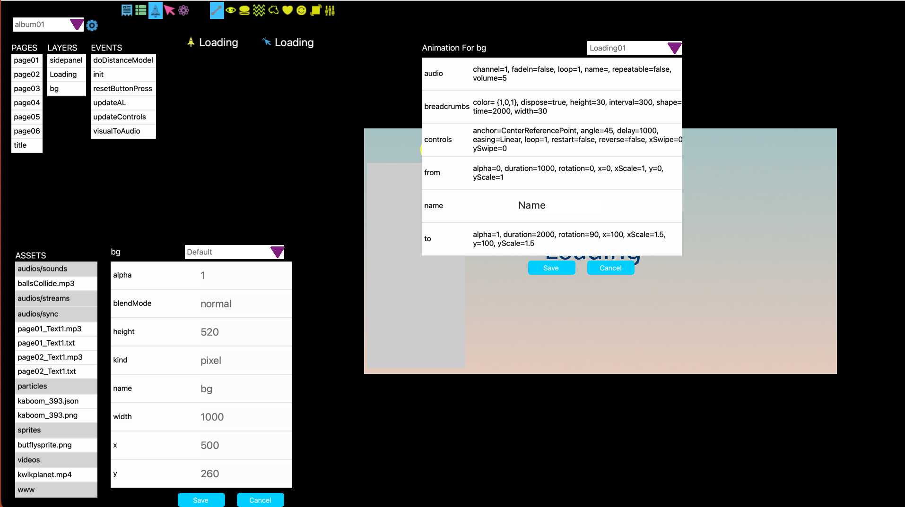

↑
Select a layer or an event to review. You can edit values of properties

TODO each kwik component with default values

TODO   ui components like checkbox/selectors ... for each component ⭐️

  > react compnents on webview -- can be shared with UXP panel which may send params via http to pegasus in kwik editor

  > current editPorpsTable.lua servers as plain table viewer & editor

TODO save/copy params to .http (YAML) for httpYac

  TODO how to send text to clipboard from Solar2D　⭐️


---
### Harness

develop/Solar2D/tools/pegasus-harness

- test_character_transitions.http
- test_Loading_animation.http

You can post params with httpYac in VS Code to a Solar2D project

TODO  set Layer varaible with samples

TODO  create models: animation, transition2, button ..., and pegasus-receiver in kwik-editor ⭐️

- Animation_bounce.http

  ```yaml
  POST /layers/logo
  Content-Type: application/yaml

  - transition: bounce
  - params:
      height: 400
      width: 200
      time: 1000
      iterations: 0
  ```


---
### Launcher

develop/Solar2D/tools/pegasus-launcher

- test-Solar2D-SampleCode.http

You can open a solar2D project from VS Code with httpYac

---
## Coding manually in VS Code

1. create .lua for commands or components
1. run the follwoing tool to update scenes/pageX/index.lua to append the new .lua to the index.

    **/develop/Solar2D/tools/generate_scene_index** is a Solar2D application. You can open the main.lua in Solar2D simulator.

    the table in the index.lua is updated by iterating files in App/bookX/components and bookX/commands
