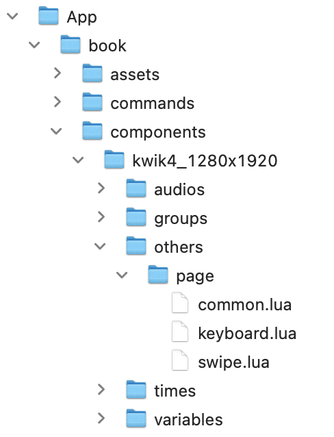
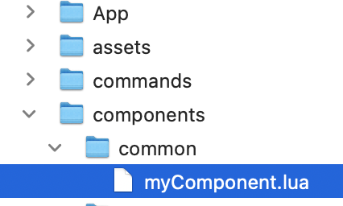

# Components

For instance others/page/swip.lua enables a page transition, and audios can have multiple audio objects.


> TODO should be page={swipe = {}, keyboard={}


```lua
local sceneName = ...
--
local scene = require('controller.scene').new(sceneName, {
    name = "kwik4_1280x1920",
    layers = {
          {  bg={
                            } },

    },
    components = {
      audios = { audioOne = {}, audioTwo = {}  },
      groups = {  },
      timers = {  },
      variables = {  },
      others = { "page.swipe", "page.keyboard" }
     },
    events = { myAction,myEvents.testHandler },
    onInit = function(scene) print("onInit") end
})
--
return scene

```

{{}}

## page

- swipe
- keyboard
- common

## audio


---
## Common components

You can add a common component to components/common directory

{{}}

And let it pass in arguments of bootstrap function in main.lua

```lua
local common = {events = {"myEvent"}, components = {myComponent={}}}

require("controller.index").bootstrap({
  name="book", sceneIndex = 1, position = {x=0, y=0},
  common =common
})

```

Common components are executed after all the layer components of a scene are rendered. So you can access a layer component by UI.layers table.

for instance, myComponent.lua attaches a tap listener

```lua

function _M:didShow(UI)
  local sceneGroup = UI.scene.view

  UI.layers.bg:addEventListener("tap", function(event)
      print("bg is taaped")
  end)

end

```