# Display Object Creation Flow

This diagram illustrates the **execution sequence** and relationship between Kwik Controller UI and Behavior Tree for display object creation.

## ⏱️ Execution Sequence
**Phase 1:** Kwik Controller UI creates all display objects → stored in UI.sceneGroup
**Phase 2:** Behavior Tree loads → can access UI.sceneGroup objects OR create new objects

```mermaid
graph TB
    Start["🚀 Application Start"]

    subgraph Phase1["⏱️ PHASE 1: Kwik Controller UI Execution"]
        KC_Composer["Composer Scene Manager"]
        KC_Scene["kwik/controller/scene.lua<br/>scene:create event"]
        KC_AppUI["controller/ApplicationUI.lua<br/>UI:create method"]
        KC_Handler["uiHandler + sceneHandler"]
        KC_SceneHandler["controller/sceneHandler.lua<br/>setMod + _create"]
        KC_LayerFile["components/forest/layers/<br/>elara_neutral.lua<br/>Layer module"]
        KC_LayerImage["kwik/components/layer_image.lua<br/>M:createImage method"]
        KC_Solar2D["Solar2D SDK<br/>display.newImageRect"]
        KC_SceneGroup["📦 UI.sceneGroup<br/>All objects stored here<br/>sceneGroup[elara_neutral]"]

        KC_Composer -->|"scene event"| KC_Scene
        KC_Scene -->|"UI:create"| KC_AppUI
        KC_AppUI -->|"callComponentsLayersHandler"| KC_Handler
        KC_Handler -->|"sceneHandler:_create"| KC_SceneHandler
        KC_SceneHandler -->|"require layer module"| KC_LayerFile
        KC_LayerFile -->|"M:create -> createImage"| KC_LayerImage
        KC_LayerImage -->|"display.newImageRect"| KC_Solar2D
        KC_Solar2D -->|"insert into sceneGroup"| KC_SceneGroup
    end

    subgraph Phase2["⏱️ PHASE 2: Behavior Tree Execution"]
        BT_Init["🌳 Behavior Tree Initialization<br/>actionController.initialize"]

        subgraph Mode1["🔄 Mode 1: Use Existing Objects from Kwik UI"]
            BT_AccessUI["Access UI.sceneGroup<br/>Get objects created by Kwik UI"]
            BT_ActionHelper1["utils/action_helper.lua<br/>actionModule.sceneObjects"]
            BT_Control["Control Operations:<br/>showObject / changeState"]
            BT_ExistingObj["✅ Manipulate Existing<br/>Display Objects"]

            BT_AccessUI -->|"Reference objects"| BT_ActionHelper1
            BT_ActionHelper1 -->|"Operations"| BT_Control
            BT_Control -->|"Update visibility/state"| BT_ExistingObj
        end

        subgraph Mode2["➕ Mode 2: Create New Objects"]
            BT_Model["models/forest/elara.lua<br/>Define states, dimensions"]
            BT_ForestModel["models/forest/forest_model.lua<br/>Aggregate object models"]
            BT_Scene["views/forest/forestScene.lua<br/>Layout & scene setup"]
            BT_Common["utils/common_helpers.lua<br/>createCharacter function"]
            BT_DisplayBase["views/display_base.lua<br/>DisplayBase:create method"]
            BT_DisplayMgr["views/displayManager.lua<br/>newImageRect wrapper"]
            BT_Solar2D2["Solar2D SDK<br/>display.newImageRect"]
            BT_NewObj["✨ New Display Objects<br/>Not in Kwik UI"]
            BT_ActionHelper2["utils/action_helper.lua<br/>Runtime control"]

            BT_Model -->|"create()"| BT_ForestModel
            BT_ForestModel -->|"objects.elara"| BT_Scene
            BT_Scene -->|"common.createCharacter"| BT_Common
            BT_Common -->|"DisplayBase:create"| BT_DisplayBase
            BT_DisplayBase -->|"displayManager.newImageRect"| BT_DisplayMgr
            BT_DisplayMgr -->|"display.newImageRect"| BT_Solar2D2
            BT_Solar2D2 --> BT_NewObj
            BT_NewObj -.->|"Runtime control"| BT_ActionHelper2
        end

        BT_Init -->|"Option A"| BT_AccessUI
        BT_Init -->|"Option B"| BT_Model
    end

    Start --> KC_Composer
    KC_SceneGroup ==>|"THEN Behavior Tree loads"| BT_Init
    KC_SceneGroup -.->|"Objects accessible via<br/>UI.sceneGroup reference"| BT_AccessUI

    style Start fill:#ffd700,stroke:#ff8c00,stroke-width:3px,color:#000
    style Phase1 fill:#e8f4f8,stroke:#4682b4,stroke-width:2px,color:#000
    style Phase2 fill:#f8f4e8,stroke:#daa520,stroke-width:2px,color:#000
    style KC_SceneGroup fill:#90EE90,stroke:#006400,stroke-width:4px,color:#000
    style BT_Init fill:#FFB6C1,stroke:#c71585,stroke-width:3px,color:#000
    style Mode1 fill:#E6E6FA,stroke:#9370db,stroke-width:2px,color:#000
    style Mode2 fill:#FFE4E1,stroke:#ff69b4,stroke-width:2px,color:#000
    style BT_AccessUI fill:#87CEEB,color:#000
    style BT_ExistingObj fill:#98FB98,color:#000
    style BT_NewObj fill:#DDA0DD,color:#000
```

## Key Architecture Points

### 🎯 Critical Execution Order
1. **First:** Kwik Controller UI system executes and creates all UI layer objects
2. **Then:** Behavior Tree system loads and can work with those objects

### 📦 UI.sceneGroup - The Shared Container
- **Created by:** Kwik Controller UI (Phase 1)
- **Stores:** All display objects as `sceneGroup[layerName]`
- **Accessed by:** Behavior Tree (Phase 2) through `actionController.initialize(self.objs)`

### 🔄 Behavior Tree - Dual Mode Operation

#### Mode 1: Use Existing Objects (Typical Use Case)
- **Purpose:** Manipulate objects already created by Kwik Controller UI
- **Access:** Through `UI.sceneGroup` reference passed to action_helper
- **Operations:**
  - `showObject()` - Make objects visible
  - `changeState()` - Switch between object states
  - Runtime control without recreation

#### Mode 2: Create New Objects (When Needed)
- **Purpose:** Create objects NOT defined in Kwik Controller UI layers
- **Process:** Uses full model → DisplayBase → displayManager flow
- **Use Case:** Dynamic game objects that aren't part of the static UI

### 🔗 Integration Points

| Component | Phase 1 (Kwik UI) | Phase 2 (Behavior Tree) |
|-----------|-------------------|-------------------------|
| **Object Storage** | UI.sceneGroup | actionModule.sceneObjects |
| **Creation Method** | layer_image.createImage() | DisplayBase:create() |
| **Lifecycle** | Composer scene events | Behavior tree actions |
| **State Management** | Layer modules | DisplayBase:changeState() |

## Key Differences

### Kwik Controller UI (Phase 1)
- **Timing:** Executes first during scene creation
- **Purpose:** Create static UI layout and page structure
- **Storage:** Objects stored in `UI.sceneGroup[layerName]`
- **Lifecycle:** Tied to Composer scene lifecycle (create, show, hide, destroy)
- **Data Flow:** Composer → ApplicationUI → SceneHandler → Layer Module → Solar2D

### Behavior Tree (Phase 2)
- **Timing:** Executes after Kwik UI completes
- **Purpose:** Add game logic and dynamic behavior
- **Access:** Can reference UI.sceneGroup objects OR create new ones
- **Flexibility:** Two modes - use existing or create new
- **Data Flow:**
  - Mode 1: UI.sceneGroup → action_helper → Object manipulation
  - Mode 2: Model → DisplayBase → DisplayManager → Solar2D

## Common Ground
Both systems ultimately call Solar2D SDK's `display.newImageRect` to create display objects, but they serve complementary purposes in a sequential architecture where UI structure is established first, then enhanced with game behavior.